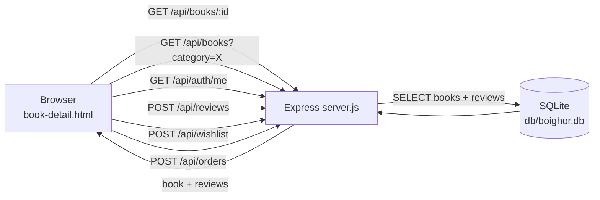
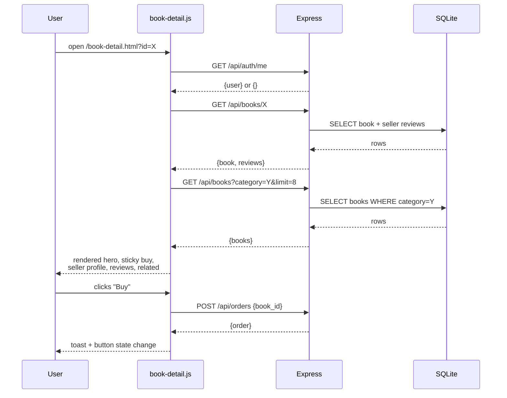

## Plan: Book Detail Page Redesign

**TL;DR.** Replace the flat `book-detail.html` with a modern two-column hero (image gallery on the left, info column on the right with a `position: sticky` buy card), followed by a full-width seller-profile card, a reviews section (summary histogram + form + review list), and a related-books grid that reuses the existing premium `.book-card` styling. All three files are rewritten/extending only — no backend changes. Verify via a new `[8/8]` invariant step in `__verify.ps1`.

**Steps**

1. **Rewrite `public/book-detail.html`** — replace the 149-line page with a new skeleton:
   - `<header class="site">` + `<main id="main" class="bd-page">` shell.
   - **Hero** (`.bd-hero`): two-column grid with `.bd-gallery` (main image `#bdMainImage` + thumb strip `#bdThumbs`) and `.bd-info` (sticky wrapper `#bdStickyBuy` containing price + buttons, then title/author/meta/description/tags).
   - **Seller profile** (`.bd-seller`): full-width card with `#bdSellerProfile`.
   - **Reviews** (`.bd-reviews`): grid with `.bd-review-summary` (avg + histogram `#bdHist`) and `.bd-review-form-wrap` (form rendered by JS), then `.bd-review-list` (`#bdReviewList`).
   - **Related** (`.bd-related`): `#bdRelated` grid (auto-fill).
   - **Modals**: keep lightbox `#bdLightbox` + message-seller `#bdMsgModal`.
   - Script tag at bottom: ``.

2. **Extend `public/css/style.css`** — append a new `.bd-*` block (after the existing `.related` block at ~line 2695). Reuse existing tokens (`--paper`, `--green-deep`, `--green-soft`, `--mustard`, `--rust`, `--line`, `--sp-*`, `--radius-*`, `--shadow-*`, `--font-sans`, `--font-serif`). New classes:
   - `.bd-page`, `.bd-hero`, `.bd-gallery`, `.bd-main-img`, `.bd-thumbs`, `.bd-thumb`, `.bd-thumb.is-active`, `.bd-info`, `.bd-meta-row`, `.bd-tags-row`, `.bd-tag`, `.bd-sticky`, `.bd-buy-card`, `.bd-price-row`, `.bd-action-row`, `.bd-seller`, `.bd-seller-head`, `.bd-seller-stats`, `.bd-seller-actions`, `.bd-reviews`, `.bd-review-summary`, `.bd-review-avg`, `.bd-hist`, `.bd-hist-row`, `.bd-hist-bar`, `.bd-review-form-wrap`, `.bd-review-form`, `.bd-review-list`, `.bd-review-card`, `.bd-related`, `.bd-related-grid`, `.bd-empty`, `.bd-bullet`, `.bd-back-row`.
   - **Responsive**: at `max-width: 980px` collapse `.bd-hero` to one column and disable `position: sticky` on `.bd-sticky` (let it flow naturally above the description on mobile).

3. **Rewrite `public/js/book-detail.js`** — drop the old renderers. New shape:
   - State: `bookId`, `book`, `currentUser`, `wishlistIds` (local Set loaded from `/api/wishlist`), `sellerStats = {avg, total, hist:[5,4,3,2,1]}`.
   - `boot()` → `initLayout()` → `loadBook()` (fetches `/api/books/:id`) → `loadRelated()` (fetches `/api/books?category=...&limit=8`, filters out current id, picks 4).
   - `renderHero()` fills main image, thumb strip (one active tile for the cover + 3 decorative placeholder tiles for "Detail/Spine/Back" that swap a label on hover), title (`#bdTitle`), author (`#bdAuthor`), meta row (stars + reviews count + condition + listed date), description (`#bdDesc`), tags row (`#bdTags`), crumbs (`#bdCrumbs`).
   - `renderStickyBuy()` fills price (`#bdPrice`), status pill (if not available), and the action buttons:
     - Not logged in → "Login to Buy" link.
     - Owner → "Manage in Dashboard" link.
     - Sold/pending → disabled button.
     - Otherwise → Buy button (POST `/api/orders`), Wishlist button (`#bdWishBtn` toggling heart icon), Share button (copies URL), Message-seller button.
   - `renderSeller()` builds the seller card with avatar initial, name, university, joined year, seller rating (computed from `book.reviews`), and a "Message seller" CTA. Contact pills only shown when `currentUser && currentUser.id !== book.seller_id`.
   - `renderReviews()` builds the summary card (avg with one decimal, histogram bars computed by counting `book.reviews` by rating, total count) and the form (rating select + textarea + submit) — only when `currentUser && currentUser.id !== book.seller_id`; otherwise show a login prompt in the form slot.
   - `renderReviewList()` maps `book.reviews` to `.bd-review-card` items (avatar initial, name, stars, date, comment); empty state when zero reviews.
   - `submitReview()` → POST `/api/reviews` with `{seller_id: book.seller_id, rating, comment}`, refetch on success, toast.
   - `toggleWishlist()` → POST `/api/wishlist` (add) or DELETE `/api/wishlist/:id` (remove); updates `wishlistIds` and the button icon.
   - `setupGallery()` swaps active thumb on click; main image click opens `#bdLightbox`.
   - `openLightbox()` / `closeLightbox()` — same pattern as before.
   - `openMessageSeller()` / `sendMessage()` — keep existing modal flow.

4. **Update `__verify.ps1`** — add `[8/8] Book detail redesign invariants` step:
   - Assert HTML markers: `bd-hero`, `bd-gallery`, `bd-sticky-buy` (or `bd-buy-card`), `bd-seller`, `bd-reviews`, `bd-related`.
   - Assert new CSS classes are present in `style.css`.
   - Assert new JS function names exist in `book-detail.js` (`renderHero`, `renderStickyBuy`, `renderSeller`, `renderReviews`, `renderRelated`, `submitReview`, `toggleWishlist`, `openLightbox`).
   - Probe `GET /api/books/1` → expect 200, `book.id === 1`, `book.title` non-empty, `book.seller_id` is a number, `Array.isArray(reviews)`.

5. **Run `__verify.ps1`** — all 8 steps must pass.

**Relevant files**
- `public/book-detail.html` — full rewrite (target ~170 lines).
- `public/css/style.css` — append a new block of `.bd-*` rules (target +400 lines); reuse existing premium-card and review-card classes for the related grid.
- `public/js/book-detail.js` — full rewrite (target ~340 lines).
- `public/js/common.js` — unchanged; uses `api`, `initLayout`, `money`, `escapeHtml`, `toast`, `confirmModal`.
- `public/js/index.js` — unchanged; its `.book-card` markup is reused by `renderRelated` for visual consistency.
- `__verify.ps1` — extend with step 8.

**Diagrams**

**Verification**

1. `__verify.ps1 [1/8]` through `[7/8]` continue to pass (no regressions).
2. `__verify.ps1 [8/8] Book detail redesign invariants` passes:
   - ≥ 6 new HTML markers found.
   - ≥ 10 new `.bd-*` CSS classes found in `style.css`.
   - ≥ 8 new JS function names found in `book-detail.js`.
   - `GET /api/books/1` returns 200 with valid `{book, reviews}` shape.
3. Manual smoke test in browser: load `/book-detail.html?id=1` — confirm hero shows gallery + sticky buy card, seller card renders, review histogram appears, related grid shows 4 cards. Resize to mobile width → sticky disabled, single column. Click wishlist → heart fills and persists across reloads.
